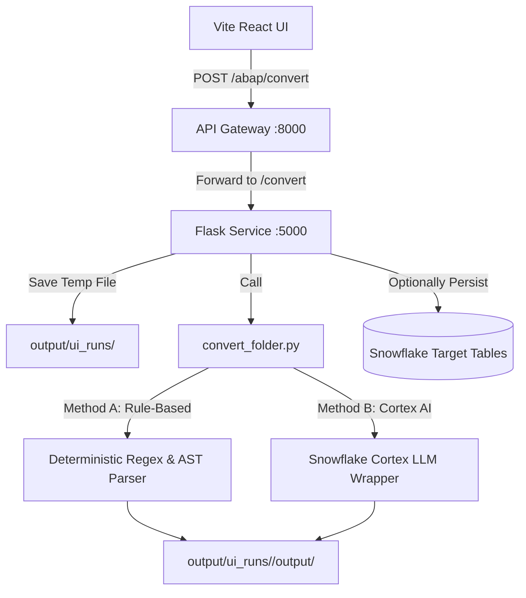

# ABAP to Snowflake SQL Conversion Engine: Data Flow & Working Logic

This document details the architecture, code flow, and logic of the **ABAP to Snowflake SQL Conversion Engine**, which translates legacy SAP ABAP/Open SQL into native Snowflake SQL syntax.

---

## 🏗️ Core Architecture & Components

The conversion process is handled by a backend service implemented in Python (Flask) located in `/Conversion_ABAP/backend/`. It exposes APIs to accept code uploads, apply conversion rules, call Snowflake Cortex AI, and write audit trails to Snowflake database tables.



### Key Components:
1.  **Flask API (`Conversion_ABAP/backend/flask_app.py`)**: Hosts endpoints for UI interactions, including `/convert` (runs conversion and returns results) and `/upload-snowflake` (writes reviewed conversions to audit tables).
2.  **Conversion Driver (`Conversion_ABAP/backend/convert_folder.py`)**: Scans input folders, routes files through conversion steps, manages deterministic logic fallbacks, and writes JSON report metadata.
3.  **Snowflake Cortex Integration (`app/services/ingestion.py` & `app/services/snowflake_connector.py`)**: Interacts with Snowflake resources and wraps query endpoints to access Cortex LLMs (such as mistral-large or llama3-70b) configured in Snowflake.

---

## 📥 Input Definitions

*   **Source ABAP file**: Raw `.abap` or `.txt` text exports containing legacy SAP Open SQL statements or full ABAP procedures.
*   **Target Configurations**: Snowflake connection details and specific metadata labels indicating the author or sub-module source.

---

## 🔄 Conversion & Transpilation Flow

### Step 1: Code Ingestion & Folder Staging
1.  The user uploads an ABAP file in the React frontend.
2.  The Flask API saves the file under a unique runtime directory:
    ```
    Conversion_ABAP/backend/output/ui_runs/<run_id>/input/<filename>.abap
    ```

### Step 2: Transpilation Engine Selection

The driver processes the input code using one of two methods (or a hybrid strategy):

#### Method A: Rule-Based Deterministic Translation
Uses regex matching and AST parsing to translate common ABAP paradigms to standard ANSI/Snowflake syntax.
*   **Key Mappings Applied**:
    *   `SELECT SINGLE ... INTO ...` -> Translates to standard `SELECT LIMIT 1` queries.
    *   `INTO TABLE @DATA(lt_result)` -> Replaces internal table references.
    *   `FOR ALL ENTRIES IN ...` -> Rewritten as standard `INNER JOIN` or `IN (val1, val2...)` clauses.
    *   Modifies SAP specific comparison operators (e.g. `EQ` -> `=`, `NE` -> `!=`, `GT` -> `>`).

#### Method B: GenAI (Snowflake Cortex) Translation
When Cortex AI is enabled, the code is passed to Snowflake's Cortex services using a specialized context prompt:
1.  The engine builds a prompt wrapping the source ABAP code.
2.  Instructs Cortex to translate Open SQL to highly optimized Snowflake SQL, preserving joins, aggregations, and sub-queries.
3.  Instructs the model to output comments detailing assumptions and possible performance caveats.

### Step 3: Analysis & Report Generation
An output JSON report is generated containing:
*   **Confidence Score**: Rated between `0.0` and `1.0` depending on the complexity of untranslatable legacy statements detected.
*   **Warnings**: Flags functions that need manual refactoring (such as SAP ABAP internal table manipulations).
*   **Assumptions**: Explains how key SAP-specific logic blocks were interpreted.
*   **Conversion Notes**: Step-by-step summary of changes made.

---

## 📤 Output & Database Audit Logging

Upon successful conversion, the system writes data to two local target files:
1.  `<source_stem>.sql`: The translated Snowflake SQL query.
2.  `<source_stem>.json`: The metadata metrics report.

If requested, the reviewed code blocks are uploaded to Snowflake for centralized storage and cataloging:
*   `CONVERSION_REQUESTS`: Logs the request ID, filename, ABAP source, line counts, and detected ABAP feature annotations.
*   `CONVERSION_RESULTS`: Links the conversion request with the generated Snowflake SQL, confidence scores, warnings, and system assumptions.
