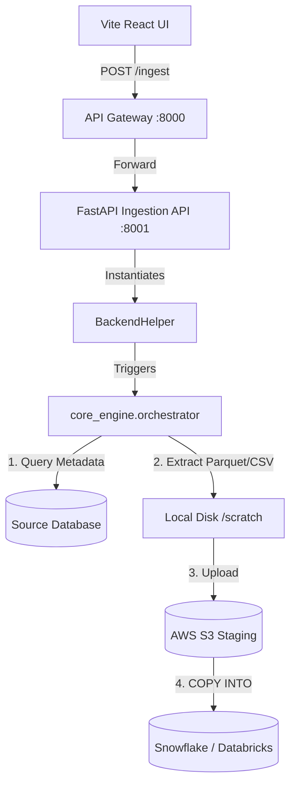

# Data Ingestion Engine: Data Flow & Working Logic

This document explains the end-to-end working mechanism and data flow of the **Data Ingestion Engine** (Full & Incremental) within the LakeSync platform.

---

## 🏗️ Core Architecture & Components

The Data Ingestion Engine is orchestrated by a backend running on Python (FastAPI). It extracts schemas, structures, and row data from on-premise relational databases, stages them as optimized file formats in cloud storage, and loads them into analytical warehouses.



### Key Components:
1.  **FastAPI Application (`ingestion_engine/api.py`)**: Defines endpoints for credentials saving, metadata retrieval, status mapping, and background extraction tasks.
2.  **Backend Helper (`ingestion_engine/backend_helper.py`)**: Interacts with connection managers and parses client payloads to trigger background pipeline processes.
3.  **Pipeline Orchestrator (`ingestion_engine/core_engine/orchestrator.py`)**: Coordinates execution state, sets table extraction ordering, monitors thread tasks, and writes migration summary reports.
4.  **Extractors (`ingestion_engine/core_engine/Extract/`)**: Database-specific engines that execute optimized batch queries to retrieve rows and convert them to optimized Parquet formats.

---

## 📥 Input Definitions

The engine consumes configuration payloads structured as follows:

```json
{
  "source": {
    "platform": "sapsqlserver",
    "host": "localhost",
    "port": "1433",
    "username": "sa",
    "password": "Password123",
    "database": "SAP_PROD"
  },
  "cloud": {
    "platform": "s3",
    "bucket_name": "lakesync-staging-bucket",
    "aws_access_key": "AKIA...",
    "aws_secret_key": "secret..."
  },
  "target": {
    "platform": "snowflake",
    "account": "xy12345.us-east-1",
    "username": "LAKESYNC_USER",
    "password": "SnowflakePassword123",
    "warehouse": "COMPUTE_WH",
    "database": "LAKESYNC_DB",
    "schema": "RAW"
  },
  "load_type": "INCREMENTAL"
}
```

*   **Mapping Definitions**: A user-defined schema alignment map specifying source-to-target column name mappings, data type conversions, Primary Keys (used for merging/deduplication), and the watermark column (e.g., `LastModifiedDate`) to filter modifications.

---

## 🔄 End-to-End Execution Flow

### Step 1: Metadata Fetch & Schema Mapping
1.  The UI requests schema metadata via `/source/schemas`, `/source/tables`, and `/source/columns`.
2.  The engine runs database catalog queries (e.g., querying `sys.tables` or `INFORMATION_SCHEMA.COLUMNS`) and returns structure metadata to the frontend.
3.  The user specifies target column mapping and saves the table metadata payload, which is saved locally as `<source_platform>_metadata.csv` (e.g. `sapsqlserver_metadata.csv`).

### Step 2: Extraction & Local Staging
1.  When `/ingest` is called, a background task initiates `run_pipeline()`.
2.  For each table configured in the metadata:
    *   **Full Load**: The engine reads the whole table, extracting records in configurable chunk offsets.
    *   **Incremental Load**: The engine looks up the target table to find the maximum watermark value (e.g., `SELECT MAX(LastModifiedDate) FROM target_table`). It then queries the source database using this watermark filter:
        ```sql
        SELECT * FROM source_table WHERE LastModifiedDate > '2026-06-10 00:00:00'
        ```
    *   The extracted rows are streamed directly to local temp memory and written as typed **Parquet files** (preserving schema types such as decimals and timestamp formats).

### Step 3: Cloud Staging Upload
1.  Using AWS SDK interfaces (e.g., `boto3`), the engine streams the local Parquet files to the configured AWS S3 bucket path:
    ```
    s3://<bucket_name>/lakesync_staging/<run_id>/<schema>_<table_name>/part-0.parquet
    ```
2.  The local scratch files are cleaned up immediately following a successful upload.

### Step 4: Warehouse Copy & Merge
1.  The engine opens a session to the target warehouse (e.g. Snowflake).
2.  If the target table does not exist, it runs a dynamically generated `CREATE TABLE` DDL query.
3.  Loads the Parquet files from S3:
    *   **For Full Load**: Truncates the target table and runs `COPY INTO <target> FROM @lakesync_stage`.
    *   **For Incremental Load**: Loads the staged parquet files into a temporary staging table, and runs a `MERGE` query:
        ```sql
        MERGE INTO target_table T
        USING temp_stage S
        ON T.primary_key = S.primary_key
        WHEN MATCHED THEN UPDATE SET T.col1 = S.col1, T.LastModifiedDate = S.LastModifiedDate ...
        WHEN NOT MATCHED THEN INSERT (primary_key, col1, ...) VALUES (S.primary_key, S.col1, ...)
        ```

---

## 📤 Output & Monitoring

*   **Migration Report**: Created upon pipeline termination inside `ingestion_engine/core_engine/logs/migration_report_<run_id>.csv` containing table status, source row count, target row count, duration, and error codes.
*   **Pipeline Status API**: The UI polls `/ingest/status` to fetch the progress percentage, current running logs, and individual table statuses (`pending`, `extracting`, `uploading`, `loading`, `completed`, or `failed`).
