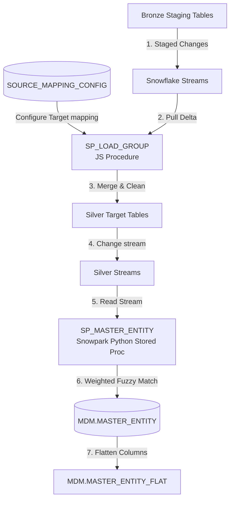

# Master Data Management (MDM) Engine: Data Flow & Working Logic

This document details the database architecture, stored procedures, and deduplication logic of the **Master Data Management (MDM) Engine** executing within Snowflake.

---

## 🏗️ Core Architecture & Components

The MDM engine functions natively inside Snowflake using **Snowpark Python**, **Javascript Stored Procedures**, **Streams**, and **Views**.



### Key Components:
1.  **Configuration Table (`BRONZE.SOURCE_MAPPING_CONFIG`)**: Registers staging-to-target tables, execution sequences, merge keys, and column mapping rules.
2.  **Staging Merge Procedure (`BRONZE.SP_LOAD_GROUP`)**: Orchestrates staging truncation and merges staging delta blocks into Silver target tables.
3.  **Snowpark Unification Procedure (`MDM.SP_MASTER_ENTITY`)**: Executes the fuzzy clustering algorithms on newly arrived records captured via streams.
4.  **Flat View (`MDM.MASTER_ENTITY_FLAT`)**: Dynamically extracts unstructured JSON columns as table columns for end-user analytics.

---

## 📥 Input Definitions & Config

The mapping configuration specifies how fields are matched and normalized:

```json
{
  "group_name": "CUSTOMER_GROUP",
  "source_system": "SAP_PROD",
  "src_db": "LAKESYNC_DB",
  "stg_schema": "BRONZE",
  "stg_table": "STG_SAP_KNA1",
  "tgt_schema": "SILVER",
  "tgt_table": "CUST_SAP",
  "merge_key": "KUNNR",
  "column_mapping": [
    {"src": "KUNNR", "tgt": "SOURCE_ID", "match_weight": 0.0, "normalize": "none"},
    {"src": "NAME1", "tgt": "CUSTOMER_NAME", "match_weight": 0.4, "normalize": "text"},
    {"src": "SMTP_ADDR", "tgt": "EMAIL", "match_weight": 0.3, "normalize": "email"},
    {"src": "TELF1", "tgt": "PHONE", "match_weight": 0.3, "normalize": "phone"}
  ]
}
```

*   `match_weight`: Importance weight (adds up to 1.0). If `0.0`, the field is stored but not used for fuzzy similarity matching.
*   `normalize`: Normalization processor keyword (`text`, `email`, `phone`, or `none`).

---

## 🔄 Unification & Matching Flow

### Step 1: Merging Staged Records (`SP_LOAD_GROUP`)
1.  Runs a JavaScript routine that gathers active table configurations.
2.  Translates configurations into dynamic SQL `MERGE` commands mapping `STG_TABLE` -> `TGT_TABLE`.
3.  Executes the `MERGE` and on success, truncates the source staging table.
4.  Logs details to the `BRONZE.MERGE_AUDIT_LOG` table.

### Step 2: Streaming Changes
Any insertions into the target Silver tables are captured by Snowflake Streams (`STREAM_NAME` configured in mapping) where `METADATA$ACTION = 'INSERT'`.

### Step 3: Fuzzy Matching & Deduplication (`SP_MASTER_ENTITY`)
The Snowpark Python procedure reads changes from the streams:

1.  **Field Normalization**:
    *   **Text**: Strips spacing, converts to lowercase: ` normalize_value(" John  Doe ") -> "john doe"`.
    *   **Email**: Strips sub-addresses: `normalize_email("John+Test@Gmail.com") -> "john@gmail.com"`.
    *   **Phone**: Extracts digits and cleans country prefix codes: `normalize_phone("+1 (555) 019-2834") -> "5550192834"`.
2.  **Existing Master Matching**:
    *   Computes a similarity score between each new record and the existing consolidated master records in `MASTER_ENTITY` using configured weights:
        $$\text{Similarity} = \frac{\sum (w_i \times \text{Similarity}(a_i, b_i))}{\sum w_i}$$
        *   *Email/Phone comparisons*: Returns `1.0` if identical, otherwise `0.0`.
        *   *Text comparisons*: Computes ratio using `rapidfuzz.fuzz.ratio`.
    *   If Similarity $\ge 85\%$ (the threshold), the new record joins the existing cluster. Its source ID is appended to `SOURCE_IDS`, and the cluster size is incremented.
3.  **New Cluster Creation**:
    *   For unmatched records, the engine clusters them against each other using the same threshold.
    *   It creates a new master entity identifier (e.g. `MSTR-00045`), saves the record payload as JSON, and inserts a new entry in `MASTER_ENTITY`.

### Step 4: Materializing Consolidated Views
Once the matching completes, the engine queries the active JSON keys within `ENTITY_DATA` and recreates the `MASTER_ENTITY_FLAT` view. This updates the schema dynamically so new columns appear automatically as typed fields.
